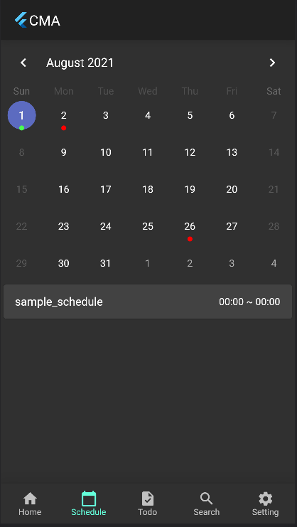

# Organization Management App

組織運営の円滑化のための Web アプリ(仮)

## 詳細

### スケジュール管理

スケジュールの管理を行う
自身のスケジュールと自身が所属している組織のスケジュールの一括で管理を行う
所属していない組織のスケジュールも公開されているものであれば閲覧できる(予定)

|     schedule_home      |     schedule_list_view      |        schedule_detail        |
| :--------------------: | :-------------------------: | :---------------------------: |
|  |  |  |

### タスク管理

タスクの管理を行う
自身のタスクと自身が所属している組織のタスクを一括管理する

|        todo01         |        todo02         |        todo03         |
| :-------------------: | :-------------------: | :-------------------: |
|  |  |  |

### 組織検索

管理されている組織を検索する
組織作成時に設定されたタグや組織名から部分一致検索を行い、結果を表示する
タップで詳細を確認できる
また、Join から組織に参加する

|        search        |     organization_detail     |
| :------------------: | :-------------------------: |
|  |  |

### 設定画面

各種設定画面
アカウントや所属している組織、スケジュールのマーカーの色などの設定を行う

|        setting        |        setting_organization        |        setting_theme        |
| :-------------------: | :--------------------------------: | :-------------------------: |
|  |  |  |

### ホーム画面

ホーム画面、当日のスケジュールの表示やおすすめの組織のレコメンドなどを行う(予定)
現在は当日のスケジュールの表示のみにつき、削除検討中

---

## 今後の課題

-   [ ] Flutter のロゴを排除して新しいロゴを作成する
-   [ ] ホーム画面の充実
-   [ ] タスク管理
    -   [ ] グループに属さない生のタスクの作成に対応する
    -   [ ] 書き込みや削除などの権限の管理
-   [ ] スケジュール管理
    -   [ ] 所属していない組織のスケジュールも閲覧のみできるようにする
    -   [ ] 書き込みや削除の権限管理

---
